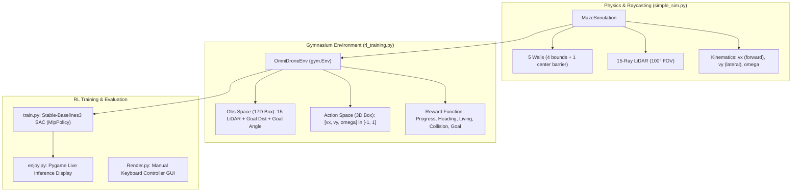

# 2D Omnidirectional Drone Navigation & Simulation (`2d` branch)

This branch focuses on the **2D Omnidirectional Simulation** for rapid prototyping of reinforcement learning (RL) navigation policies and heuristic planners. It isolates the navigation and obstacle-avoidance dynamics from complex 3D aerodynamic simulation, enabling fast training and iteration.

---

## 📌 Architecture Overview



---

## 📁 Repository Structure (`2d` Branch)

| File | Purpose | Key Details |
| :--- | :--- | :--- |
| [`simple_sim.py`](file:///home/nycolas/m/simple_sim.py) | **2D Kinematic & Raycast Engine** | Manages pose `[x, y, theta]`, 10x10m arena bounds, 3 asymmetric pillars (2.2x2.2m, 1.5x1.5m, 1.2x1.2m, 16 walls total), analytical vectorized LiDAR (15 rays across 100°), wall and pillar collision avoidance. |
| [`rl_training.py`](file:///home/nycolas/m/rl_training.py) | **Gymnasium Environment (`OmniDroneEnv`)** | Normalizes observation space (17 floats), maps 3D action space to global velocities, shapes reward with orientation bonus and penalties, manages randomized spawn positions with strict pillar rejection. |
| [`train.py`](file:///home/nycolas/m/train.py) | **SAC Training Script** | Uses `stable_baselines3.SAC` with vectorized `DummyVecEnv` (16 envs, ~2,500 FPS), supports warm-starts and learning rate adaptation, logs to `./sac_tensorboard/`. |
| [`enjoy.py`](file:///home/nycolas/m/enjoy.py) | **Inference Visualizer** | Loads trained model (`base` / checkpoint), runs environment in Pygame at 60 FPS showing drone, target, walls, shaded pillars, and LiDAR rays. |
| [`Render.py`](file:///home/nycolas/m/Render.py) | **Interactive Manual GUI** | Pygame viewer allowing manual keyboard control (`Arrows` for translation, `Q`/`E` for rotation, `R` to respawn) to test engine physics and sensor rays. |
| [`ai/`](file:///home/nycolas/m/ai) | **AI Tracking & Documentation** | Contains [`goals.md`](file:///home/nycolas/m/ai/goals.md) (active milestones), [`explanations.md`](file:///home/nycolas/m/ai/explanations.md) (technical rationale/math), and [`decisions.md`](file:///home/nycolas/m/ai/decisions.md) (decision log). |

### Legacy / 3D Artifacts (from `main` branch)
- [`hoverEnv.py`](file:///home/nycolas/m/hoverEnv.py) / [`debug.py`](file:///home/nycolas/m/debug.py): Legacy scripts importing `uav_env.py` (PyBullet 3D drone env from `main`).
- `hoverDrone_stable.zip`, `navDrone_v1.zip`, `navDrone_v1_plus.zip`: Checkpoints trained on the 3D PyBullet environment.
- `3d_tensorboard/`: TensorBoard run logs from 3D experiments.

---

## 🤖 Environment Specifications

### 1. State & Kinematics
- **Arena Dimensions:** $10\text{m} \times 10\text{m}$ (coordinates $[-5.0, 5.0] \times [-5.0, 5.0]$).
- **Obstacles (3 Asymmetric Pillars):**
  - Large Pillar: $2.2\text{m} \times 2.2\text{m}$ ($[-3.2, -1.0] \times [1.0, 3.2]$)
  - Small Pillar 1: $1.5\text{m} \times 1.5\text{m}$ ($[1.2, 2.7] \times [-3.2, -1.7]$)
  - Small Pillar 2: $1.2\text{m} \times 1.2\text{m}$ ($[1.4, 2.6] \times [1.4, 2.6]$)
- **Tight Navigable Corridors:** Corridor clearances range from $1.8\text{m}$ (boundary walls) to $2.4\text{m}$–$3.1\text{m}$ (between pillars).
- **Randomized Safe Spawning:** Drone and objective spawn at uniformly randomized valid locations on every reset. Rejection sampling strictly forbids spawning inside or near pillars ($\ge 0.45\text{m}$ clearance) and enforces $\ge 1.8\text{m}$ initial drone-target separation.
- **Topological Accessibility:** The navigable workspace is an open, connected manifold with 3 holes. Every corridor exceeds $1.8\text{m}$ ($>4.5\times$ robot diameter $0.4\text{m}$).
- **Kinematics:**
  $$\begin{bmatrix} \dot{x} \\ \dot{y} \end{bmatrix} = \begin{bmatrix} \cos\theta & -\sin\theta \\ \sin\theta & \cos\theta \end{bmatrix} \begin{bmatrix} v_x \\ v_y \end{bmatrix}$$
  $$\dot{\theta} = \omega$$
- **Velocity limits:** $v_{\max} = 2.0\text{ m/s}$, $\omega_{\max} = 3.0\text{ rad/s}$.
- **Collision Radius:** $r_{\text{robot}} = 0.2\text{ m}$.

### 2. Action Space (`spaces.Box(-1.0, 1.0, shape=(3,))`)
Continuous 3D normalized commands:
- `action[0]`: Normalized forward velocity $v_x \in [-2.0, 2.0]\text{ m/s}$
- `action[1]`: Normalized lateral velocity $v_y \in [-2.0, 2.0]\text{ m/s}$
- `action[2]`: Normalized angular velocity $\omega \in [-3.0, 3.0]\text{ rad/s}$

### 3. Observation Space (`spaces.Box(-1.0, 1.0, shape=(17,))`)
Continuous 17D vector:
- `obs[0:15]`: 15 LiDAR distance readings spanning 100° FOV centered along heading $\theta$, normalized by `max_range = 10.0` to $[0, 1]$.
- `obs[15]`: Relative Euclidean distance to target waypoint, normalized by arena diagonal ($\approx 28.28\text{ m}$) into $[0, 1]$.
- `obs[16]`: Relative angle to target waypoint in robot local frame, normalized by $\pi$ into $[-1.0, 1.0]$.

### 4. Reward Shaping
- **Living penalty:** $-0.01$ per timestep.
- **Distance Progress:** $+10.0 \times (d_{t-1} - d_t) \times \max(0.1, \cos(\theta_{\text{goal}}))$
  - Penalizes stagnation: $-0.01$ if $|d_{t-1} - d_t| < \frac{r_{\text{robot}}}{15}$.
  - Encourages facing the goal while progressing.
- **FOV Bonus:** $+0.01$ when target is within sensor field of view.
- **Inactivity Penalty:** $-0.1$ if total commanded velocity $< 0.1$.
- **Wall Proximity Warning:** $-0.05$ if distance to nearest wall $\le r_{\text{robot}} + 0.075\text{ m}$.
- **Collision:** $-1.0$ penalty and `terminated = True` if distance to wall $\le r_{\text{robot}} + 0.01\text{ m}$.
- **Goal Reached:** $+100.0$ and `terminated = True` if distance to target $< 0.25\text{ m}$.

---

## 🛠️ Execution & Development (Python 3.12)

> **Important:** Always execute with Python 3.12. The project's active virtual environment is located at `.venv/`.

### Interactive Manual Test
Test the 2D physics engine, raycaster, and arena visualization with keyboard controls:
```bash
.venv/bin/python3.12 -c "from simple_sim import MazeSimulation; from Render import Renderer; sim = MazeSimulation(); Renderer(sim).run()"
```
- **Arrow Keys:** Move robot ($v_x, v_y$).
- **Q / E:** Rotate robot left / right ($\omega$).

### Training an RL Agent
Launch SAC training using Stable-Baselines3:
```bash
.venv/bin/python3.12 train.py
```

### Visualizing Training (TensorBoard)
```bash
.venv/bin/python3.12 -m tensorboard.main --logdir ./sac_tensorboard/
```

### Inference / Policy Replay
Evaluate a trained model checkpoint:
```bash
.venv/bin/python3.12 enjoy.py
```

---

## 🧠 Known Challenges & Research Directions

1. **The U-Trap Paradox (Zero-Memory Local Minima)**
   - Current policy uses `MlpPolicy` (feed-forward MLP).
   - Feed-forward networks evaluate only the immediate frame. When encountering a concave obstacle (such as a U-trap or long wall) directly between the robot and target, the agent cannot deduce that moving backward/away from the goal is necessary.
2. **Mitigation Approaches:**
   - **Recurrent Policy (Memory):** Switch to `RecurrentPPO` (LSTM) from `sb3-contrib` so the agent recognizes temporal stagnation.
   - **Observation Frame Stacking:** Stack the last $k$ frames of observations/LiDAR rays so the network perceives velocity and history.
   - **Hierarchical Navigation (A* + SAC):** Combine a global topological/grid planner (A*) providing intermediate local sub-waypoints with SAC handling dynamic local collision avoidance.